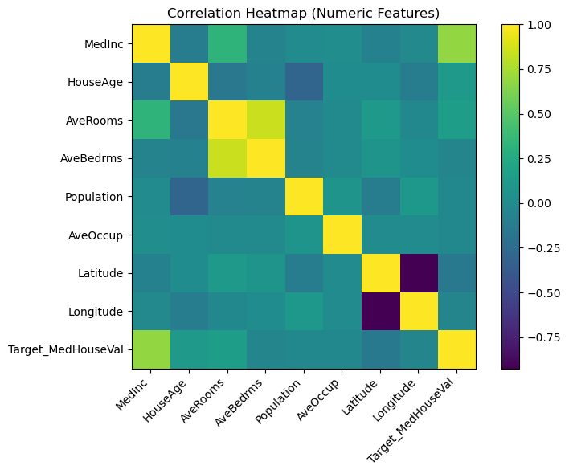
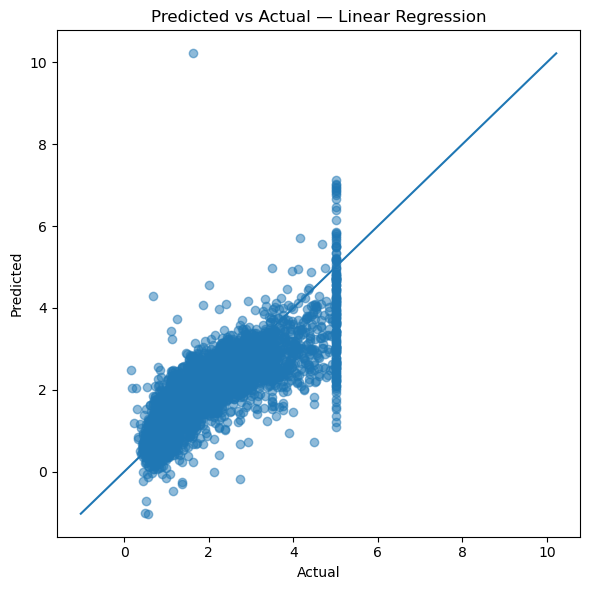
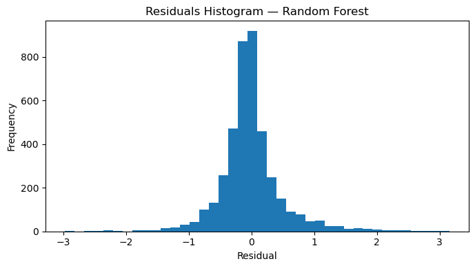
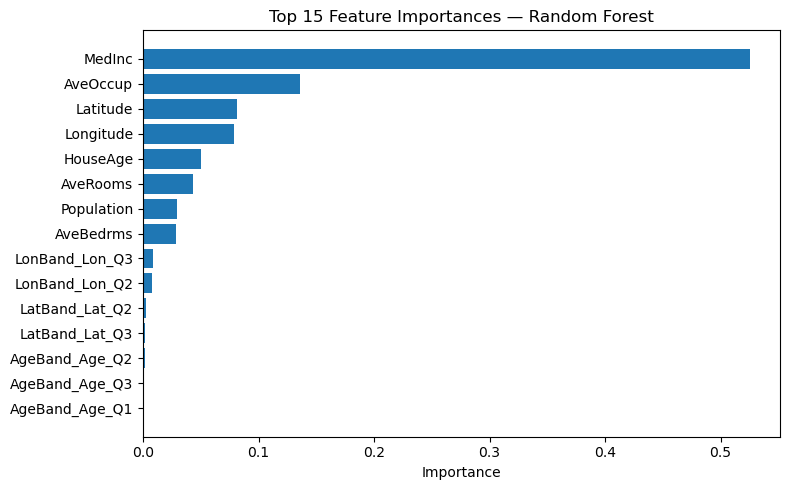

# 🏠 House Price Prediction — Regression Project
This project is a university-style machine learning assignment that predicts housing prices using regression models.
It uses the Boston Housing dataset (via OpenML) or falls back to California Housing if Boston is unavailable.

---

# 📌 Project Overview
The goal is to:
- Perform feature preprocessing (scaling numeric data, one-hot encoding categorical variables).
- Compare Linear Regression and Random Forest models.
- Evaluate models using MAE, MSE, RMSE, R² metrics.
- Visualize results (correlation heatmap, predicted vs actual, residuals, feature importance).

---

# 📂 Dataset
- Primary: [Boston Housing Dataset](https://www.openml.org/d/531)
- Fallback: [California Housing Dataset](https://scikit-learn.org/stable/modules/generated/sklearn.datasets.fetch_california_housing.html)

---

# ⚙️ Requirements
Install dependencies:
```bash
pip install scikit-learn pandas numpy matplotlib seaborn
```

---

# 🚀 Running the Project
Run in Jupyter Notebook, VS Code, or PyCharm.

1. Clone the repository:
  ```bash
  git clone https://github.com/yourusername/house-price-prediction.git
  cd house-price-prediction
  ```
2. Run the .ipynb file:
  ```bash
  jupyter notebook House_Price_Prediction.ipynb
  ```
# 📊 Model Workflow
1. **Data Loading**
2. **Preprocessing**
3. **Modeling**
4. **Evaluation Metrics**
5. **Visualizations**


Load Boston Housing from OpenML.

Fallback to California Housing if needed.

Preprocessing

Scale numeric features with StandardScaler.

Encode categorical features with OneHotEncoder.

Use ColumnTransformer for clean pipelines.

Modeling

Linear Regression (baseline).

Random Forest Regressor (non-linear, tree-based).

Evaluation Metrics

MAE (Mean Absolute Error)

MSE (Mean Squared Error)

RMSE (Root Mean Squared Error)

R² Score (Coefficient of Determination)

Cross-validation for robustness.

Visualizations

Correlation heatmap.

Predicted vs Actual scatter plots.

Residual distribution plot.

Feature importance for Random Forest.
## Visual Insights

| Plot | Description |
|------|-------------|
|  | Correlation matrix of numeric features |
|  | Model performance on test set |
|  | Distribution of prediction errors |
|  | Most influential features |

---
